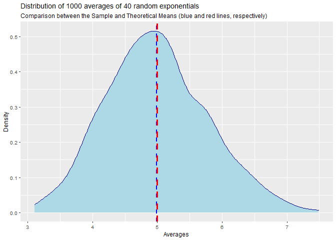
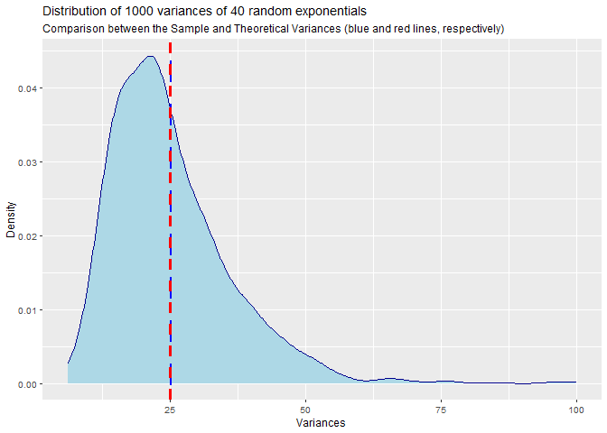
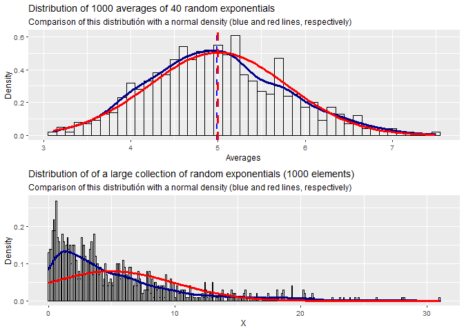

[Github link](https://github.com/darwinnava/Statistical_Inference_Project)

## Data processing


It is required to simulate a distribution of averages of 40 exponentials in R and compare it with the Central Limit Theorem. Lambda = 0.2 has been set for thousand (1000) simulations.  

The properties of the distribution of the mean of 40 exponentials should be illustrated. Specifically,  
- The sample and theoretical means.  
- The sample and theoretical variances.  
- A distribution that should be approximately normal(here, focus on the difference between the distribution of a large collection of random exponentials and the distribution of a large collection of averages of 40 exponentials).

### Simulations
**Generate data for a distribution of 1000 averages of 40 random exponentials**  


```r
sim_number <- 1000 # number of simulations
elem_number <- 40 # Number of elements in each exponential distribution
rate_parameter <- 0.2 # Rate parameter
set.seed(1) # 
averages = NULL
variances = NULL
for (i in 1 : sim_number) averages = c(averages, mean(rexp(n=elem_number, rate = rate_parameter)))
set.seed(1) # 
for (i in 1 : sim_number)  variances = c(variances, var(rexp(n=elem_number, rate = rate_parameter)))
```


**Generate data for a distribution of a large collection of random exponentials (1000 elements, lambda= 0.2)**  

```r
set.seed(2)
large_collection <-  rexp(n=sim_number, rate = 0.2)
```


## Results
### Comparison between the Sample and Theoretical Means

```
## [1] "The sample mean: 4.99002520077716 | The Theoretical Mean (1/lambda): 5"
```

<!-- -->
   
**Observations: Both values are similar. The sample mean of a distribution of 1000 averages of 40 random exponentials coincides with what is described by the CLT.**     

### Comparison between the Sample and Theoretical Variances

```
## [1] "The mean of variances: 25.0645859581104 | The Theoretical variance (1/lambda^2): 25"
```
<!-- -->
   
**Observations: Both values are similar. The sample variance of a distribution of 1000 averages of 40 random exponentials coincides with what is described by the CLT.**    

### Distribution
**Distribution of 1000 averages of 40 random exponentials versus Distribution of a large collection of random exponentials**  

<!-- -->
    
**Observations: The distribution for a large collection of averages of 40 exponentials is approximately normal. However, the distribution of a large collection of random exponentials is exponential. **   

## Conclusions
the Central Limit Theorem (CLT) apply to Exponential Probability Distributions (EPD) too. The distribution of 1000 averages of 40 random exponentials simulated approximates a normal distribution regardless of its distribution in the population.  
end/final

## Appendix - Code 
### Data processing 

```r
library(dplyr)
library(ggplot2)
library(gridExtra)
```
### Simulations

```r
sim_number <- 1000 # number of simulations
elem_number <- 40 # Number of elements in each exponential distribution
rate_parameter <- 0.2 # Rate parameter
set.seed(1) # 
averages = NULL
variances = NULL
for (i in 1 : sim_number) averages = c(averages, mean(rexp(n=elem_number, rate = rate_parameter)))
set.seed(1) # 
for (i in 1 : sim_number)  variances = c(variances, var(rexp(n=elem_number, rate = rate_parameter)))
```

```r
head(averages)
head(variances)
length(averages)
length(variances)
```

```r
set.seed(2)
large_collection <-  rexp(n=sim_number, rate = 0.2)
```

```r
head(large_collection)
length(large_collection)
```
### Comparison between the Sample and Theoretical Means

```r
smean <- mean(averages) # the sample mean
tmean <- 1/rate_parameter # 1/lambda is mean in this kind of distribution
print(paste("The sample mean:", smean, "|", "The Theoretical Mean (1/lambda):", tmean))
```

```r
theme_set(theme_gray(base_size = 9))
ggplot(as.data.frame(averages), aes(x = averages)) + geom_density(color="darkblue", fill="lightblue")+geom_vline(aes(xintercept=mean(averages)), color="blue", linetype="dashed", size=1)+geom_vline(aes(xintercept=tmean), color="red", linetype="dashed", size=1.2)+ labs(title = "Distribution of 1000 averages of 40 random exponentials",subtitle = "Comparison between the Sample and Theoretical Means (blue and red lines, respectively)") + labs(x="Averages", y= "Density")
```
### Comparison between the Sample and Theoretical Variances

```r
svariance <- (mean(variances)) # the sample variance
tvariance <- 1/(rate_parameter^2) # 1/(lambda^2) is variance in this kind of distribution
print(paste("The mean of variances:", mean(variances), "|", "The Theoretical variance (1/lambda^2):", tvariance))
```

```r
theme_set(theme_gray(base_size = 9))
ggplot(as.data.frame(variances), aes(x = variances)) + geom_density(color="darkblue", fill="lightblue")+geom_vline(aes(xintercept=svariance), color="blue", linetype="dashed", size=1)+geom_vline(aes(xintercept=tvariance), color="red", linetype="dashed", size=1.2)+ labs(title = "Distribution of 1000 variances of 40 random exponentials",subtitle = "Comparison between the Sample and Theoretical Variances (blue and red lines, respectively)") + labs(x="Variances", y= "Density")
```
###Distribution of 1000 averages of 40 random exponentials versus Distribution of a large collection of random exponentials  


```r
theme_set(theme_gray(base_size = 9))

plot1<- ggplot(as.data.frame(averages), aes(x = averages)) + geom_histogram(aes(y=..density..), colour="black", fill="white", alpha = .10, binwidth=0.1)+ geom_density(color="darkblue", size=1.2)+ stat_function(fun = dnorm, args = list(mean = 5, sd = 5/sqrt(40)), size=1.2, color="red") +  geom_vline(aes(xintercept=mean(averages)), color="blue", linetype="dashed",size=1)+geom_vline(aes(xintercept=tmean), color="red", linetype="dashed", size=1.2)+ labs(title = "Distribution of 1000 averages of 40 random exponentials",subtitle = "Comparison of this distributión with a normal density (blue and red lines, respectively)") + labs(x="Averages", y= "Density")

plot2<- ggplot(as.data.frame(large_collection), aes(x = large_collection)) + geom_histogram(aes(y=..density..), colour="black", fill="white", alpha = .10, binwidth=0.1)+ geom_density(color="darkblue", size=1.2)+ stat_function(fun = dnorm, args = list(mean = 5, sd = 5/sqrt(1)), size=1.2, color="red") + labs(title = "Distribution of of a large collection of random exponentials (1000 elements)",subtitle = "Comparison of this distributión with a normal density (blue and red lines, respectively)") + labs(x="X", y= "Density")

grid.arrange(plot1, plot2, nrow = 2)
```
