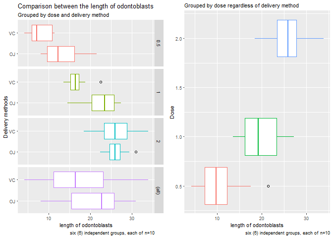
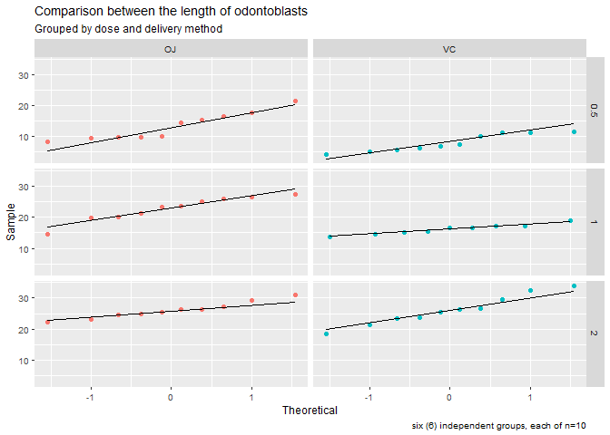

[Github link](https://github.com/darwinnava/Statistical_Inference_Project)

## Data processing


This project involves exploring the ToothGrowth data in the R datasets package . This data tracks responses of the length of odontoblasts (cells responsible for tooth growth) in 60 guinea pigs. Each animal received one of three dose levels of vitamin C (0.5, 1, and 2 mg/day) by one of two delivery methods, orange juice (code as OJ) or ascorbic acid (a form of vitamin C and coded as VC).

### An exploratory statistical analysis. Summary of the data
**Loading the R object ToothGrowth and displaying the internal structure.** 
This will allow establishing a strategy for answering the study question: Does vitamin C dose size affect tooth growth in guinea pigs?  

```
## 'data.frame':	60 obs. of  3 variables:
##  $ len : num  4.2 11.5 7.3 5.8 6.4 10 11.2 11.2 5.2 7 ...
##  $ supp: Factor w/ 2 levels "OJ","VC": 2 2 2 2 2 2 2 2 2 2 ...
##  $ dose: num  0.5 0.5 0.5 0.5 0.5 0.5 0.5 0.5 0.5 0.5 ...
```
  
**Let's see the variable len in each of these groups which contains ten (n=10) guinea pigs:**
<!-- -->
  
**Observations:** Greater growth of odontoblasts is observed for the 0.5 and 1 mg doses delivered by the coded OJ (orange juice) delivery method. For the 2 mg dose, the delivery method does not appear to influence such growth. In reference to dose size, when this increases, the odontoblasts growth also does so.  OJ has higher tooth growth in guinea pigs than VC. Observations considered as potential outliers by the IQR criterion are displayed as points in the boxplot. Points were observed in the following delivery method - dose combinations : a) VC - 1, b) OJ - 2, c) VC Union OJ - 0.5.  

Check portential outliers with boxplot.stats()$ out function:

```
## [1] 22.5
```

```
## numeric(0)
```

```
## numeric(0)
```
**Only len=22.5 with dose=1 and supp="VC" is an outlier. This record is deleted**


  
Studying the estimation precision of a study is  important. Similarly, the results relevance. Once a sample variable value has been calculated, it is required to approximate the range of values where lies the inaccessible real value of that population variable. Therefore, different statistical inference methods should be applied.

### An Inferential Data Analysis of the ToothGrowth Data 
The most common methodologies in inferential statistics are confidence intervals, hypothesis tests, and regression analysis. The first two will be used. 

**Creating 95% Confidence intervals for the means estimated using Gosset's T distribution which is a method for small sample.**  
The T interval technically assumes that the data are iid normal. It works well whenever the distribution of the data is roughly symetric and mound shaped. 


<!-- -->
  
**Observations:** Checking the normal quantile plot: The normal quantile plots lie approximately on a straight line. We can conclude that the len distribution is approximately normally distributed. T 95% Confidence intervals are calculated (see columns conf_int_left and conf_int_right). 

*Grouping the data using the variables dose and supp*  
In order to answer the questions posed, the data will be grouped by the variables: dose and supp. With the objective of determining the doses and the delivery methods associated with each guinea pig. A new dataframe called toothgrowth_supp_dose is created. 

```
## `summarise()` has grouped output by 'supp'. You can override using the `.groups` argument.
```

```
## # A tibble: 6 x 8
## # Groups:   supp [2]
##   supp  dose      n len_mean len_sd len_var conf_int_left conf_int_right
##   <fct> <fct> <int>    <dbl>  <dbl>   <dbl>         <dbl>          <dbl>
## 1 OJ    0.5      10    13.2    4.46   19.9          10.0           16.4 
## 2 OJ    1        10    22.7    3.91   15.3          19.9           25.5 
## 3 OJ    2        10    26.1    2.66    7.05         24.2           28.0 
## 4 VC    0.5      10     7.98   2.75    7.54          6.02           9.94
## 5 VC    1         9    16.1    1.60    2.56         14.9           17.4 
## 6 VC    2        10    26.1    4.80   23.0          22.7           29.6
```
  
**Hypothesis Tests**  
**1. Effectiveness of the delivery method disregarding dosage.**  
Hypothesis: OJ has higher tooth growth in guinea pigs than VC. 
Assumptions: independent samples and randomly selected from the population. the sample size is 30 and 29 for each method (coded as OJ and VC respectively). Outliers were not observed in this case. Unequal variances. 95% confidence level.
**Ha: len|OJ > len|VC**

```
## 
## 	Welch Two Sample t-test
## 
## data:  ToothGrowth$len[ToothGrowth$supp == "OJ"] and ToothGrowth$len[ToothGrowth$supp == "VC"]
## t = 1.9815, df = 53.309, p-value = 0.02635
## alternative hypothesis: true difference in means is greater than 0
## 95 percent confidence interval:
##  0.6039947       Inf
## sample estimates:
## mean of x mean of y 
##  20.66333  16.77241
```
  
**Observations: OJ has higher tooth growth in guinea pigs than VC.**

**2. Effectiveness of administered dose size regardless of delivery method.**  
Ha: In reference to dose size, when this increases, the odontoblasts growth also does so. len|0.5 < len|1 < len|2. Assumptions: independent samples and randomly selected from the population. the sample size is 20, 19 and 20 (coded as 0.5, 1, and 2 respectively). Outliers were previously eliminated. Unequal variances. 95% confidence level.

**Ha: len|0.5 < len|1**  

```
## 
## 	Welch Two Sample t-test
## 
## data:  ToothGrowth$len[ToothGrowth$dose == 1] and ToothGrowth$len[ToothGrowth$dose == 0.5]
## t = 6.2417, df = 36.908, p-value = 1.494e-07
## alternative hypothesis: true difference in means is greater than 0
## 95 percent confidence interval:
##  6.555854      Inf
## sample estimates:
## mean of x mean of y 
##  19.58947  10.60500
```
    
**Observations: when dose increases, the odontoblasts growth also does, len|0.5 < len|1**      
**Ha: len|1 < len|2 **  

```
## 
## 	Welch Two Sample t-test
## 
## data:  ToothGrowth$len[ToothGrowth$dose == 2] and ToothGrowth$len[ToothGrowth$dose == 1]
## t = 4.8911, df = 35.245, p-value = 1.097e-05
## alternative hypothesis: true difference in means is greater than 0
## 95 percent confidence interval:
##  4.261981      Inf
## sample estimates:
## mean of x mean of y 
##  26.10000  19.58947
```
  
**Observations: when dose increases, the odontoblasts growth also does, len|0.5 < len|1 < len|2**  
  
**3. Effectiveness of 2 mg administered dose size by delivery method.**
Ha: For the 2 mg dose, the delivery method does not appear to influence such growth.
Assumptions: independent samples and randomly selected from the population. the sample size is 10 for both VC and JO. Outliers were not observed. Unequal variances. 95% confidence level.
**Ha: len|2|VC =! len|2|OJ**  

```
## 
## 	Welch Two Sample t-test
## 
## data:  ToothGrowth$len[ToothGrowth$dose == 2 & ToothGrowth$supp == "VC"] and ToothGrowth$len[ToothGrowth$dose == 2 & ToothGrowth$supp == "OJ"]
## t = 0.046136, df = 14.04, p-value = 0.9639
## alternative hypothesis: true difference in means is not equal to 0
## 95 percent confidence interval:
##  -3.63807  3.79807
## sample estimates:
## mean of x mean of y 
##     26.14     26.06
```
  
**Observations: when dose increases to 2 mg, the delivery method does not influence such growth. The observed p-value 0.96 is greater than 0.05 and the 95 percent confidence interval contains zero.**

## Conclusions 
Greater growth of odontoblasts is observed for the 0.5 and 1 mg doses delivered by the coded OJ (orange juice) delivery method. For the 2 mg dose, the delivery method does not influence such growth. OJ yields higher tooth growth in guinea pigs than VC. In reference to dose size, when this increases, the odontoblasts growth also does.

## Appendix - Code 
**Data processing**

```r
#libraries
library(dplyr)
library(ggplot2)
library(gridExtra)
library(datasets)
```
**An exploratory statistical analysis. Summary of the data**
**Loading the R object ToothGrowth and displaying the internal structure.** 


```r
data("ToothGrowth") #Loading the data
str(ToothGrowth) 
```
**Let's see the variable len in each of these groups which contains guinea pigs:**

```r
theme_set(theme_gray(base_size = 8))
plot1 <- ggplot(ToothGrowth, aes(x = len, y=supp, color=factor(dose)))+ geom_boxplot(outlier.colour = "black", outlier.shape = 1) + facet_grid(dose~., margins = TRUE)+ labs(title = "Comparison between the length of odontoblasts",subtitle = "Grouped by dose and delivery method") + labs(x="length of odontoblasts", y= "Delivery methods", caption = "six (6) independent groups, each of n=10") + theme(legend.position="none")

theme_set(theme_gray(base_size = 8))
plot2 <- ggplot(ToothGrowth, aes(x = len, y=dose, color=factor(dose)))+ geom_boxplot(outlier.colour = "black", outlier.shape = 1) + labs(subtitle = "Grouped by dose regardless of delivery method") + labs(x="length of odontoblasts", y= "Dose", caption = "six (6) independent groups, each of n=10") + theme(legend.position="none")

grid.arrange(plot1, plot2, ncol=2)
```
**Check ans eliminate outliers with boxplot.stats () $ out function:**

```r
boxplot.stats(ToothGrowth$len[ToothGrowth$dose==1 & ToothGrowth$supp=="VC"])$out
boxplot.stats(ToothGrowth$len[ToothGrowth$dose==2 & ToothGrowth$supp=="OJ"])$out
boxplot.stats(ToothGrowth$len[ToothGrowth$dose==0.5 ])$out
```

```r
ToothGrowth <- ToothGrowth[-which(ToothGrowth$len %in% c(22.5)),]
```
**An Inferential Data Analysis of the ToothGrowth Data**
**Creating 95% Confidence intervals for the means estimated using Gosset's T distribution which is a method for small sample.**  

```r
theme_set(theme_gray(base_size = 9))
ggplot(ToothGrowth, aes(sample=len))+ stat_qq(aes(color=supp))+ facet_grid(dose~supp, margins = FALSE)+ stat_qq_line()+labs(title = "Comparison between the length of odontoblasts",subtitle = "Grouped by dose and delivery method") + labs(x="Theoretical", y= "Sample", caption = "six (6) independent groups, each of n=10") + theme(legend.position="none")
```
**Grouping the data using the variables dose and supp**  

```r
by_supp_dose <- group_by(ToothGrowth, supp, dose=as.factor(dose))
toothgrowth_supp_dose <- summarize(by_supp_dose, n=length(len), len_mean=mean(len), , len_sd=sd(len),len_var=var(len))
#head(toothgrowth_supp_dose)
toothgrowth_supp_dose$conf_int_left <- (toothgrowth_supp_dose$len_mean - qt(0.975,toothgrowth_supp_dose$n-1)*toothgrowth_supp_dose$len_sd/sqrt(toothgrowth_supp_dose$n))
toothgrowth_supp_dose$conf_int_right <- (toothgrowth_supp_dose$len_mean + qt(0.975,toothgrowth_supp_dose$n-1)*toothgrowth_supp_dose$len_sd/sqrt(toothgrowth_supp_dose$n))
toothgrowth_supp_dose
```
**Hypothesis Tests**
**1. Effectiveness of the delivery method disregarding dosage.**  
Ha: OJ has higher tooth growth in guinea pigs than VC. 
**Ha: len|OJ > len|VC** 

```r
t.test(ToothGrowth$len[ToothGrowth$supp=="OJ"], ToothGrowth$len[ToothGrowth$supp== "VC"], alternative = "greater", var.equal = FALSE, paired = FALSE)
```
** 2. Effectiveness of administered dose size regardless of delivery method. **
Ha: In reference to dose size, when this increases, the odontoblasts growth also 
**Ha: len|0.5 < len|1**  

```r
t.test(ToothGrowth$len[ToothGrowth$dose==1], ToothGrowth$len[ToothGrowth$dose==0.5], alternative = "greater", var.equal = FALSE, paired = FALSE)
```
**Ha: len|1 < len|2 **  

```r
t.test(ToothGrowth$len[ToothGrowth$dose==2], ToothGrowth$len[ToothGrowth$dose==1], alternative = "greater", var.equal = FALSE, paired = FALSE)
```
**3. Effectiveness of 2 mg administered dose size by delivery method.**  
**Ha: len|2|VC =! len|2|OJ**  

```r
t.test(ToothGrowth$len[ToothGrowth$dose==2 & ToothGrowth$supp=="VC"], ToothGrowth$len[ToothGrowth$dose==2 & ToothGrowth$supp=="OJ"], alternative = "two.sided", var.equal = FALSE, paired = FALSE)
```
